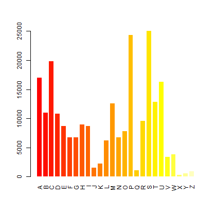

```{r setup, include=FALSE}
knitr::opts_chunk$set(echo = TRUE)
```

```{r load-data, include = FALSE}
hist_dat <- read.delim("histogram.tsv")
barplot_dat <- read.delim("barplot_dat.tsv")
#vowels_dat <- read.delim("vowels_count.tsv")
```

The file `words.txt` could be downloaded at http://svnweb.freebsd.org/base/head/share/dict/web2?view=co. This report shows a barplot with the counts of words that starts with each letter of the alphabet.

This data set contains `r format(sum(hist_dat$Freq), nsmall=1, big.mark=",")` words which start with `r dim(barplot_dat)[1]` different letters. The counts of that words are shown in the following graph.



The most common initial letter is `r barplot_dat[which.max(barplot_dat$Freq),1]` with `r format(max(barplot_dat$Freq), nsmall=1, big.mark=",")` counts, and the less frequent is initial letter is `r barplot_dat[which.min(barplot_dat$Freq),1]` with `r format(min(barplot_dat$Freq), nsmall=1, big.mark=",")` counts.


